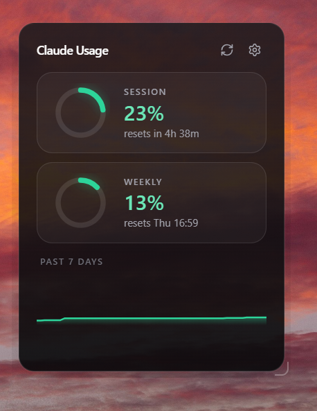
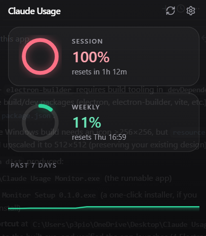
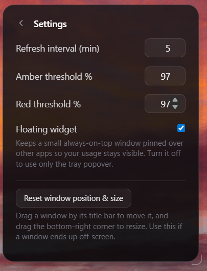
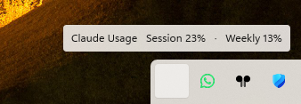

# Claude Usage Monitor

A small desktop app (Electron + React) that shows your Claude usage at a glance:
the current 5-hour session window and the 7-day weekly window, with reset
countdowns, a 7-day history chart, threshold notifications, and a glass UI that
lives in the system tray.

It reads the same data the Claude app's Usage screen shows, by reusing your
authenticated claude.ai session (you sign in once through an embedded window).

## Screenshots

### Tray panel



The main panel is a frameless glass card that floats over your desktop. Each
window has a ring meter: **Session** is the rolling 5-hour limit, **Weekly** is
the 7-day all-models limit. Every ring shows the percent used and when it
resets — a countdown while it's hours away (`resets in 4h 38m`), or the weekday
and time once it's further out (`resets Thu 16:59`). The **Past 7 days**
sparkline at the bottom charts your weekly usage over time. Ring color moves
from green to amber to red as you approach a limit.

### Near the limit



At 100% the session ring turns red. This shot also shows the window is genuinely
transparent — the content behind it (here, an editor) shows through the frosted
glass, rather than a flat opaque background.

### Settings



Settings let you set the **refresh interval**, the **amber/red alert
thresholds** (a desktop notification fires once when you cross each), a toggle
for the always-on-top **floating widget**, and a **reset window position & size**
button for when a window ends up off-screen.

### Tray hover



Hover the tray icon for a quick tooltip with your current session and weekly
percentages, without opening the panel. Left-click toggles the panel;
right-click gives Refresh and Quit.

## How it works

- The main process owns the claude.ai session, all network calls, scheduling,
  storage, and notifications. The renderer only displays a normalized snapshot
  received over a typed IPC bridge — it never touches the network or cookies.
- Usage comes from an internal claude.ai endpoint
  (`/api/organizations/{org}/usage`). The response (`five_hour` / `seven_day`
  utilization + reset times) is parsed into a small `UsageSnapshot`.

> Note: this uses an internal, undocumented endpoint. It can change at any time.
> Personal use only; not affiliated with Anthropic.

## Develop

```bash
npm install
npm run dev      # launch the app (sign in when the window appears)
npm test         # unit tests (parser, history, thresholds, settings, format)
npm run typecheck
npm run build
npm run dist     # package a Windows installer
```

## Stack

Electron, TypeScript, electron-vite, React, Vite, Tailwind CSS, Vitest,
electron-builder.
